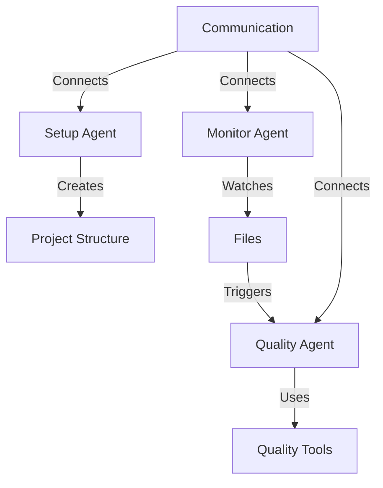

# Agent Coordinator Documentation

## Overview

The Agent Coordinator system provides automated code quality monitoring through a system of coordinated agents:

- [Setup Agent](agents/setup.md): Project structure management
- [Monitor Agent](agents/monitor.md): File change detection
- [Quality Agent](agents/quality.md): Code quality analysis

## Getting Started

1. [Installation Guide](installation.md)
2. [Basic Usage](examples/basic.md)
3. [Configuration](configuration/standards.md)

## Architecture

## Quick Links

- [Configuration Guide](configuration/standards.md)
- [Advanced Examples](examples/advanced.md)
- [API Reference](api/README.md) 