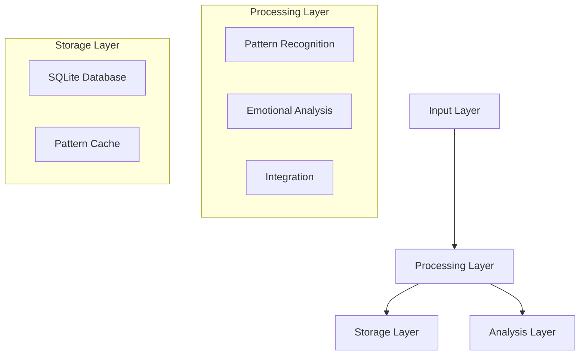

# Project Handoff: Cognitive Agents System

## System Overview

### Current State
The system successfully implements:
1. Multi-agent cognitive processing
2. Pattern recognition and storage
3. Emotional analysis
4. Integration synthesis

### Core Components


## Working Features

### 1. Processing Modes
- ✅ Single thought processing
- ✅ Batch processing (3+ thoughts)
- ✅ Sequential processing (2 thoughts)

### 2. Pattern Recognition
- ✅ Pattern detection
- ✅ Pattern storage
- ✅ Cache system
- ✅ Sequence tracking

### 3. Test Coverage
```python
# Core Tests
✓ test_single_thought
✓ test_batch_processing
✓ test_sequential_processing

# Database Tests
✓ Pattern storage
✓ Cache operations
✓ Cleanup functionality
```

## Next Features

### 1. Multi-Dimensional Agent System
```python
IMPLEMENTATION_ROADMAP = {
    'phase_1': {
        'vertical': {
            'surface': 'Initial pattern recognition',
            'intermediate': 'Connection analysis',
            'deep': 'Meta-pattern synthesis'
        }
    },
    'phase_2': {
        'horizontal': {
            'emotional': 'Emotional pattern recognition',
            'behavioral': 'Action pattern analysis',
            'somatic': 'Physical sensation patterns'
        }
    },
    'phase_3': {
        'diagonal': {
            'emotional_depth': 'Deep emotional pattern evolution',
            'behavioral_meta': 'Meta-analysis of action patterns',
            'somatic_integration': 'Body-mind pattern integration'
        }
    }
}
```

### 2. Integration Mechanisms
- Cross-dimensional pattern synthesis
- Evolution tracking across dimensions
- Meta-pattern recognition
- Unified insight generation

### 3. Agent Factory Implementation
- Dynamic agent creation
- Multi-dimensional specialization
- Resource optimization
- Adaptive scaling

### 4. Community Integration
```python
COMMUNITY_FEATURES = {
    'pattern_validation': {
        'status': 'ready_for_implementation',
        'dependencies': ['current_pattern_store'],
        'priority': 'high'
    },
    'voting_system': {
        'status': 'designed',
        'dependencies': ['pattern_validation'],
        'priority': 'high'
    },
    'growth_tracking': {
        'status': 'designed',
        'dependencies': ['pattern_validation', 'voting_system'],
        'priority': 'medium'
    }
}
```

### 5. Technical Debt
- Add error recovery for API timeouts
- Implement proper connection pooling
- Add metrics collection
- Enhance test coverage

### 6. Known Issues
1. Cache cleanup needs optimization
2. API rate limiting needed
3. Better error handling in batch processing

## Development Guide

### 1. Local Setup
```bash
# Clone repository
git clone <repo>
cd cognitive-agents

# Install dependencies
pip install -e .

# Run tests
pytest tests/ -v
```

### 2. Key Files
```
cognitive-agents/
├── cognitive_agents/
│   ├── agents/           # Core agent implementations
│   ├── pattern_store/    # Database and caching
│   └── visualization/    # Pattern visualization
├── tests/               # Test suite
└── docs/               # Documentation
```

### 3. Configuration
- Database settings in `config/settings.py`
- Processing modes in `config/processing.py`
- API settings in `config/api.py`

## Next Steps

### 1. Immediate Priorities
1. Implement pattern validation
2. Add community voting
3. Setup growth tracking
4. Enhance error handling

### 2. Future Improvements
1. Add real-time updates
2. Implement WebSocket support
3. Add metrics dashboard
4. Enhance visualization

### 3. Documentation Needs
1. API documentation
2. Integration guide
3. Community guidelines
4. Pattern validation rules

## Contact
For questions or clarification:
- Project Lead: [Name]
- Technical Lead: [Name]
- Documentation: [Name]