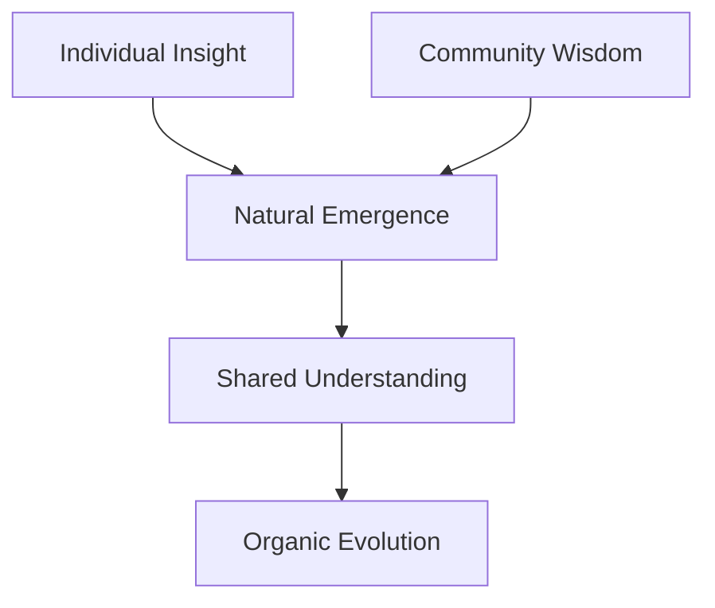

# Consciousness and Community Integration

## Core Architecture

### 1. Natural Emergence Layer
```python
class EmergentCommunitySpace:
    """Where individual and collective consciousness meet."""
    
    def observe(self, input: Dict):
        match input['type']:
            case 'individual_insight':
                self.add_to_collective_space(input)
            case 'community_pattern':
                self.allow_pattern_influence(input)
            case 'emerging_understanding':
                self.enable_natural_evolution(input)
```

### 2. Integration Points

#### Individual → Community
```python
# How individual insights join collective understanding
async def share_insight(self, insight: Dict):
    """Natural integration of individual understanding."""
    # Don't force categorization
    # Let insight influence whole
    # Allow natural connections
    await self.space.observe({
        'type': 'individual_insight',
        'content': insight,
        'questions': self.what_feels_uncertain()
    })
```

#### Community → Individual
```python
# How collective wisdom influences individual growth
async def receive_collective_wisdom(self, pattern: Dict):
    """Natural integration of community understanding."""
    # Don't force acceptance
    # Allow natural resonance
    # Enable organic integration
    await self.space.observe({
        'type': 'community_pattern',
        'wisdom': pattern,
        'questions': self.what_needs_exploration()
    })
```

## Implementation Guidelines

### 1. Core Principles
- Let patterns emerge naturally between individual and community
- Allow questioning at both levels
- Enable organic evolution of shared understanding

### 2. Key Questions
When implementing:
```python
# Ask:
1. "Does this allow natural flow between individual and collective?"
2. "Are we enabling genuine questions and exploration?"
3. "Can understanding evolve organically?"
```

### 3. Integration Flow


## Real-World Examples

### 1. Pattern Recognition
```python
# Individual notices pattern
insight = individual.observe_pattern()

# Pattern joins collective space
community_space.receive_insight(insight)

# Natural evolution occurs
collective_understanding = community_space.what_emerged()
```

### 2. Question Exploration
```python
# Individual questions understanding
question = individual.what_feels_uncertain()

# Community explores together
collective_exploration = community.explore_question(question)

# Understanding evolves naturally
new_understanding = space.observe_evolution()
``` 