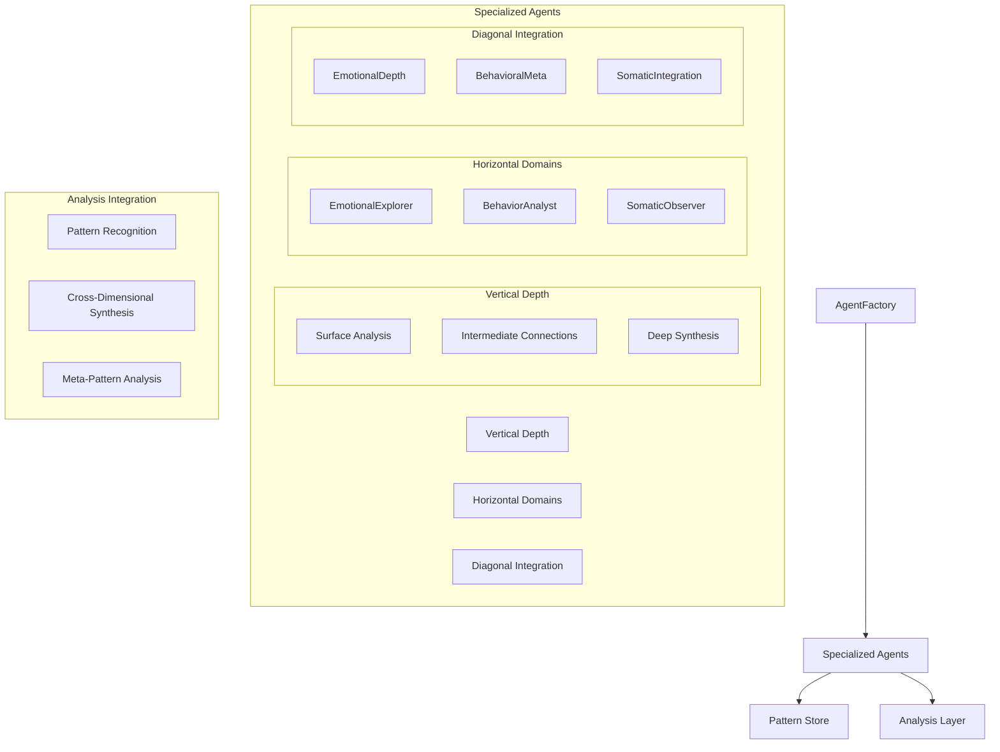
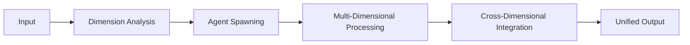

# System Architecture

## Core Components

### 1. Agent System


### 2. Multi-Dimensional Processing
```python
PROCESSING_DIMENSIONS = {
    'vertical': {
        'purpose': 'Depth of analysis',
        'levels': ['surface', 'intermediate', 'deep'],
        'integration': 'Sequential deepening'
    },
    'horizontal': {
        'purpose': 'Domain specialization',
        'domains': ['emotional', 'behavioral', 'somatic'],
        'integration': 'Parallel processing'
    },
    'diagonal': {
        'purpose': 'Cross-cutting synthesis',
        'combinations': [
            'emotional_depth',
            'behavioral_meta',
            'somatic_integration'
        ],
        'integration': 'Pattern evolution tracking'
    }
}
```

### 3. Integration Flow
- **Vertical Integration**: Deepening understanding within domains
- **Horizontal Integration**: Combining domain-specific insights
- **Diagonal Integration**: Tracking pattern evolution and meta-patterns
- **Cross-Dimensional Synthesis**: Unified multi-perspective understanding

### 4. Agent Factory
```python
AGENT_CREATION_STRATEGY = {
    'content_analysis': {
        'emotional_indicators': 'Spawn emotional agents',
        'behavioral_patterns': 'Spawn behavioral agents',
        'somatic_markers': 'Spawn somatic agents'
    },
    'depth_requirements': {
        'surface_patterns': 'Initial recognition',
        'connection_patterns': 'Intermediate analysis',
        'meta_patterns': 'Deep synthesis'
    },
    'diagonal_triggers': {
        'pattern_evolution': 'Track through depth',
        'cross_domain': 'Integrate specialties',
        'meta_analysis': 'Analyze pattern systems'
    }
}
```

### 5. Data Flow


## Processing Flow

### 1. Input Processing
```python
async def process_thoughts(self, thoughts: Union[str, List[str]]) -> Dict:
    """Process single or multiple thoughts."""
    if isinstance(thoughts, str):
        return await self._process_single(thoughts)
    
    if len(thoughts) >= 3:
        return await self._process_batch(thoughts)
    
    return await self._process_sequential(thoughts)
```

### 2. Pattern Recognition
- Pattern detection
- Cache utilization
- Sequence tracking
- Pattern evolution

### 3. Emotional Analysis
- Primary emotions
- Secondary emotions
- Emotional context
- Emotional transitions

### 4. Integration
- Cross-perspective connections
- Meta understanding
- Evolution tracking

## Next Steps

### 1. Community Features
- Pattern validation system
- Community voting
- Growth tracking
- Support routing

### 2. Technical Improvements
- Enhanced caching
- Parallel processing
- API optimization
- Error recovery

### 3. Testing
- Integration tests
- Load testing
- Error scenarios
- Edge cases