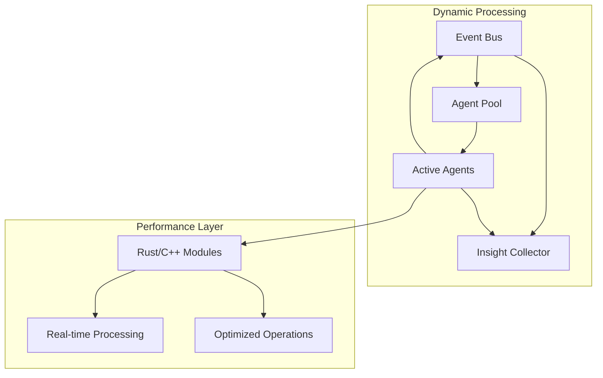

# System Architecture

## Core Components

### 1. Event-Driven Orchestration


### 2. Processing Flow
```python
PROCESSING_DYNAMICS = {
    'event_driven': {
        'purpose': 'Natural emergence of insights',
        'mechanism': 'Subscribe and publish',
        'flow': 'Content-guided processing'
    },
    'hybrid_processing': {
        'orchestration': {
            'layer': 'Python',
            'purpose': 'High-level coordination',
            'strengths': ['rapid development', 'flexibility', 'integration ease']
        },
        'performance': {
            'layer': 'Rust/C++',
            'purpose': 'Compute-intensive operations',
            'strengths': ['speed', 'memory efficiency', 'parallel processing']
        }
    }
}
```

### 3. Integration Flow
- **Event Bus**: Central nervous system for agent communication
- **Agent Pool**: Dynamic resource management
- **Insight Collector**: Organic pattern synthesis
- **Performance Layer**: Optimized processing modules

## Next Steps

### 1. Community Features
- Pattern validation system
- Community voting
- Growth tracking
- Support routing

### 2. Technical Improvements
- Enhanced caching
- Parallel processing
- API optimization
- Error recovery

### 3. Testing
- Integration tests
- Load testing
- Error scenarios
- Edge cases