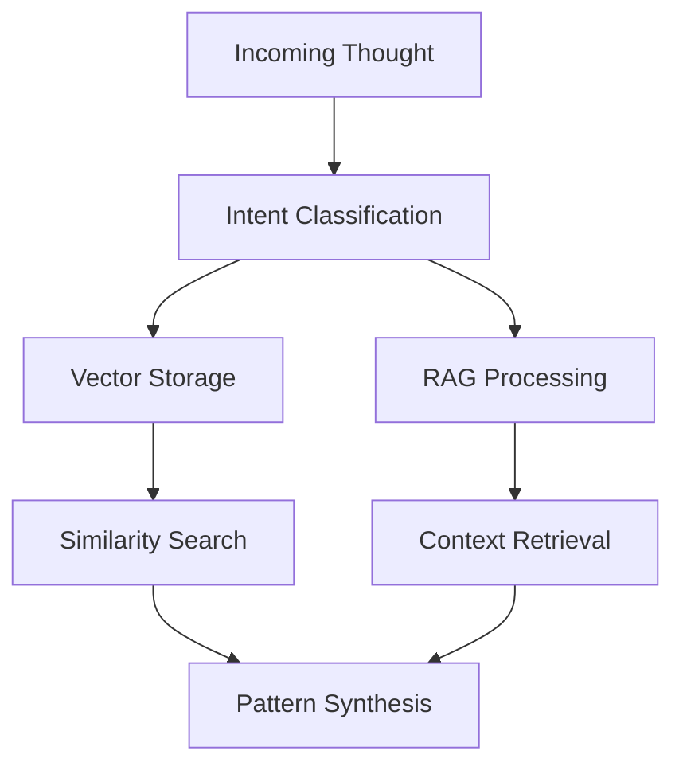

# Memory Architecture

## Overview
The system uses a hybrid memory architecture combining:
1. Intentional Vector Storage
2. RAG (Retrieval Augmented Generation)
3. Symbolic Pattern Matching

## Memory Components

### Intentional Vector Storage
- Purpose: Semantic similarity matching with intent context
- Organization: Memory organized by intention categories
- Implementation: Using sentence-transformers for embeddings

### RAG Layer
- Purpose: Augment pattern analysis with relevant context
- Integration: Works alongside vector storage
- Use Cases: 
  - Enriching pattern analysis
  - Providing historical context
  - Supporting reflection loops

### Symbolic Pattern Matching
- Purpose: Rule-based pattern recognition
- Integration: Works in parallel with vector/RAG
- Benefits: Maintains interpretability

## Integration Flow

## Usage Guidelines
1. Vector storage for semantic similarity
2. RAG for context enrichment
3. Symbolic matching for interpretable patterns

## Implementation Phases
1. Core Intentional Memory
2. RAG Integration
3. Enhanced Pattern Recognition
4. Reflection Loops 