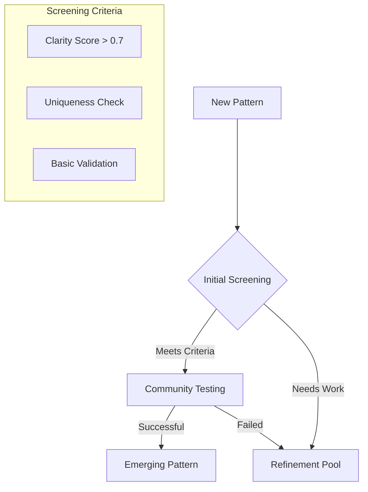
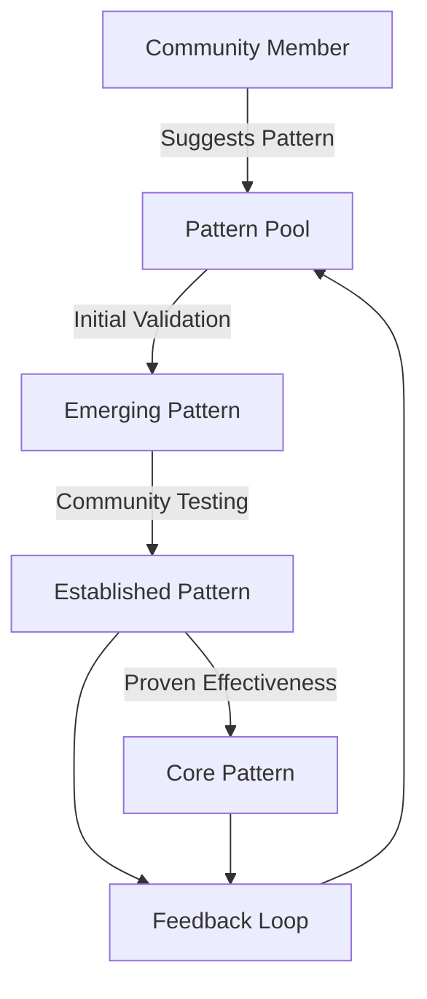

# Community Governance System

## Pattern Recognition Democracy

### 1. Pattern Voting System
```python
class PatternVoting:
    """Democratic pattern validation system"""
    
    VALIDATION_LEVELS = {
        'emerging': {
            'required_votes': 10,
            'confidence_threshold': 0.6,
            'review_period_days': 7
        },
        'established': {
            'required_votes': 50,
            'confidence_threshold': 0.8,
            'review_period_days': 30
        },
        'core': {
            'required_votes': 200,
            'confidence_threshold': 0.9,
            'review_period_days': 90
        }
    }
    
    VALIDATION_METRICS = {
        'effectiveness': {
            'weight': 0.4,
            'criteria': [
                'pattern_accuracy',
                'insight_value',
                'practical_utility',
                'consistency'
            ]
        },
        'relevance': {
            'weight': 0.3,
            'criteria': [
                'community_need',
                'growth_impact',
                'applicability',
                'timeliness'
            ]
        },
        'clarity': {
            'weight': 0.3,
            'criteria': [
                'understandability',
                'actionability',
                'measurability',
                'specificity'
            ]
        }
    }
    
    VOTING_POWER = {
        'base_member': 1.0,
        'active_contributor': 1.2,
        'pattern_validator': 1.5,
        'system_governor': 2.0
    }
```

### 2. Voting Mechanics

#### A. Vote Types
```python
VOTE_TYPES = {
    'upvote': {
        'weight': 1.0,
        'requires_feedback': False
    },
    'downvote': {
        'weight': -1.0,
        'requires_feedback': True
    },
    'refinement': {
        'weight': 0.5,
        'requires_feedback': True,
        'bonus_if_implemented': 0.5
    },
    'validation': {
        'weight': 2.0,
        'requires_evidence': True,
        'requires_testing': True
    }
}

VOTING_RULES = {
    'daily_limit': 10,
    'feedback_minimum_length': 50,
    'cooling_period_hours': 24,
    'required_testing_days': 3
}
```

#### B. Vote Calculation
```python
def calculate_pattern_score(pattern: Dict) -> float:
    """Calculate weighted pattern score."""
    base_score = (
        (pattern.upvotes * VOTE_TYPES['upvote']['weight']) +
        (pattern.downvotes * VOTE_TYPES['downvote']['weight']) +
        (pattern.refinements * VOTE_TYPES['refinement']['weight']) +
        (pattern.validations * VOTE_TYPES['validation']['weight'])
    )
    
    # Apply voter reputation weights
    weighted_score = base_score * voter_reputation_multiplier
    
    # Apply effectiveness metrics
    effectiveness = calculate_effectiveness_metrics(pattern)
    
    return weighted_score * effectiveness
```

### 3. Pattern Evolution Metrics

#### A. Emergence Phase


#### B. Validation Thresholds
```python
VALIDATION_THRESHOLDS = {
    'emergence': {
        'clarity_score': 0.7,
        'uniqueness_score': 0.6,
        'initial_support': 5
    },
    'establishment': {
        'effectiveness_score': 0.8,
        'community_support': 0.7,
        'test_results': 0.75
    },
    'core_status': {
        'long_term_value': 0.9,
        'widespread_adoption': 0.8,
        'consistent_results': 0.85
    }
}
```

### 4. Quality Control

#### A. Feedback Requirements
- Detailed reasoning for downvotes
- Evidence for validation votes
- Testing results for establishment
- Impact metrics for core status

#### B. Gaming Prevention
```python
ANTI_GAMING_MEASURES = {
    'vote_velocity_check': True,
    'diversity_requirement': True,
    'evidence_validation': True,
    'peer_review': True,
    'automated_pattern_testing': True
}
```

### 2. Pattern Evolution Process


### 3. Voting Rights
- Earned through participation
- Based on contribution quality
- Tied to growth journey
- Scaled by expertise area

### 4. Pattern Proposal Process
1. **Submission**
   - Pattern description
   - Supporting evidence
   - Use cases
   - Expected outcomes

2. **Review Period**
   - Community testing
   - Result tracking
   - Effectiveness voting
   - Refinement suggestions

3. **Integration**
   - Pattern validation
   - System incorporation
   - Usage monitoring
   - Ongoing refinement 