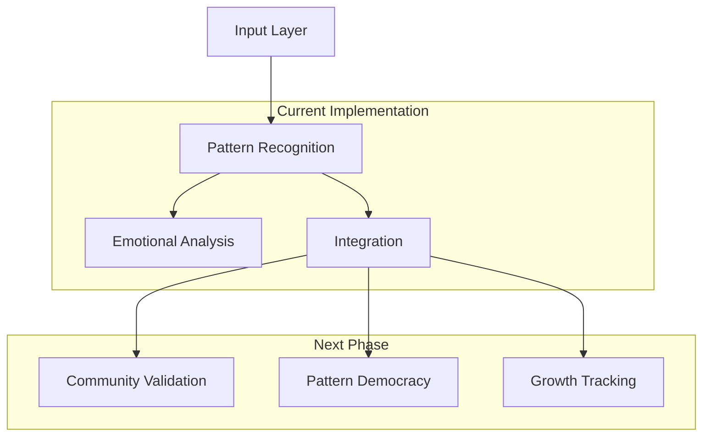

# Vision: Community-Driven AI Growth Platform

## Current Foundation

### 1. Core Engine (Implemented)
```python
CURRENT_CAPABILITIES = {
    'pattern_recognition': {
        'thought_analysis': True,
        'emotional_tracking': True,
        'behavioral_insights': True
    },
    'multi_agent_system': {
        'pattern_analyst': True,
        'emotional_explorer': True,
        'integration_synthesizer': True
    },
    'base_architecture': {
        'sqlite_storage': True,
        'caching_system': True,
        'parallel_processing': True
    }
}
```

### 2. System Architecture


## Evolution Path

### 1. Community Governance Layer
- Built on existing PatternStore
- Extends current validation system
- Adds community voting
- Implements pattern evolution

### 2. Pattern Democracy Integration
```python
PATTERN_EVOLUTION = {
    'current_patterns': {
        'source': 'AI_analysis',
        'validation': 'system_metrics',
        'evolution': 'fixed_rules'
    },
    'future_patterns': {
        'source': ['AI_analysis', 'community_proposals'],
        'validation': ['system_metrics', 'community_testing'],
        'evolution': 'democratic_process'
    }
}
```

### 3. Growth Framework Extension
- Builds on current pattern recognition
- Adds community validation
- Integrates collective wisdom
- Maintains privacy controls

## Technical Implementation

### 1. Database Evolution
```sql
-- Extend current schema
ALTER TABLE patterns ADD COLUMN community_validated BOOLEAN;
ALTER TABLE patterns ADD COLUMN validation_score REAL;
ALTER TABLE patterns ADD COLUMN community_feedback TEXT;

-- New community tables
CREATE TABLE pattern_proposals (
    id INTEGER PRIMARY KEY,
    pattern_data JSON,
    status TEXT,
    validation_metrics JSON
);
```

### 2. API Extension
```python
class CommunityPatternStore(PatternStore):
    """Extends current PatternStore with community features"""
    async def submit_pattern(self, pattern: Dict):
        # Current pattern storage
        pattern_id = await self.store_pattern(pattern)
        
        # New community validation
        await self.initiate_validation(pattern_id)
        
    async def validate_pattern(self, pattern_id: str):
        # Community testing process
        # Evidence collection
        # Democratic validation
```

### 3. Privacy Architecture
- Builds on current encryption
- Adds selective sharing
- Implements community anonymization
- Maintains user control

## Growth Strategy

### Phase 1: Foundation (Current)
- ✅ Pattern recognition
- ✅ Emotional analysis
- ✅ Basic integration
- ✅ Data storage

### Phase 2: Community Integration
1. **Pattern Democracy**
   - Community validation system
   - Pattern voting mechanism
   - Evolution tracking
   - Quality metrics

2. **Growth Framework**
   - Personal tracking
   - Community insights
   - Progress visualization
   - Support routing

### Phase 3: Advanced Features
1. **Collective Intelligence**
   - Pattern emergence
   - Wisdom aggregation
   - Community moderation
   - Knowledge evolution

2. **Support System**
   - Peer support
   - Professional integration
   - Crisis routing
   - Resource matching

## Implementation Guide

### 1. Extend Current System
```python
# Build on existing agents
class CommunityAwarePatternAnalyst(PatternAnalyst):
    """Extends current PatternAnalyst with community features"""
    
    async def analyze_pattern(self, thought: str):
        # Current analysis
        base_patterns = await self._find_patterns(thought)
        
        # New community validation
        validated_patterns = await self._validate_with_community(base_patterns)
        return validated_patterns
```

### 2. Add Community Layer
```python
# New community governance
class PatternDemocracy:
    """Implements community pattern validation"""
    
    async def validate_pattern(self, pattern: Dict):
        # Community testing
        # Evidence collection
        # Democratic validation
        # Quality assurance
```

### 3. Integrate Growth Framework
```python
# Growth tracking system
class GrowthFramework:
    """Implements personal growth tracking"""
    
    async def track_progress(self, user_id: str):
        # Pattern analysis
        # Growth metrics
        # Community insights
        # Support routing
```

## Next Steps

### 1. Technical Foundation
- Extend current pattern store
- Implement community validation
- Add voting system
- Build growth tracking

### 2. Community Features
- Pattern proposal system
- Validation framework
- Democratic governance
- Support routing

### 3. Growth Tools
- Progress tracking
- Insight visualization
- Community support
- Professional integration

## Success Metrics

### 1. Pattern Quality
- Validation rates
- Community engagement
- Implementation evidence
- Growth impact

### 2. System Health
- Processing efficiency
- Cache effectiveness
- Privacy maintenance
- Community vitality

### 3. User Impact
- Growth progress
- Pattern adoption
- Support effectiveness
- Community contribution

## Conclusion
This vision builds on our strong foundation in pattern recognition and emotional analysis, extending it with community governance and growth tracking while maintaining our commitment to privacy and user agency.